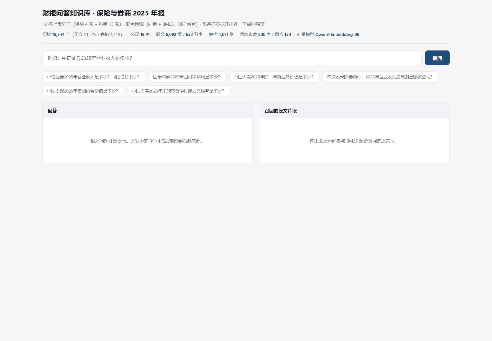
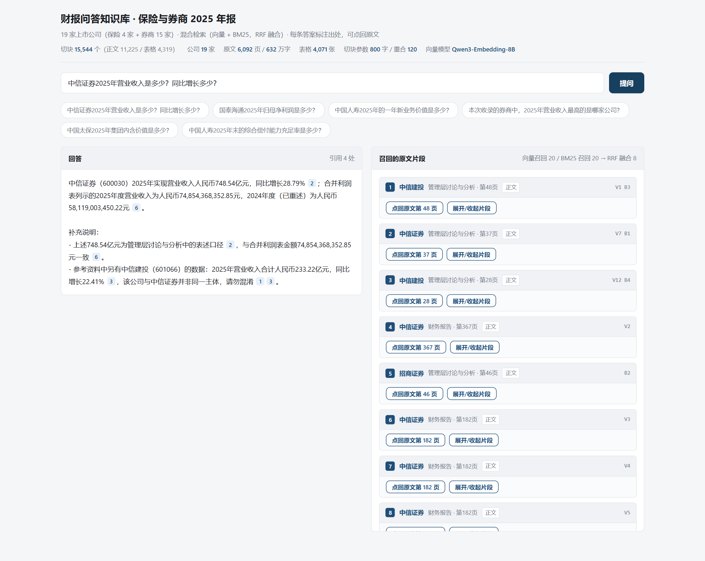
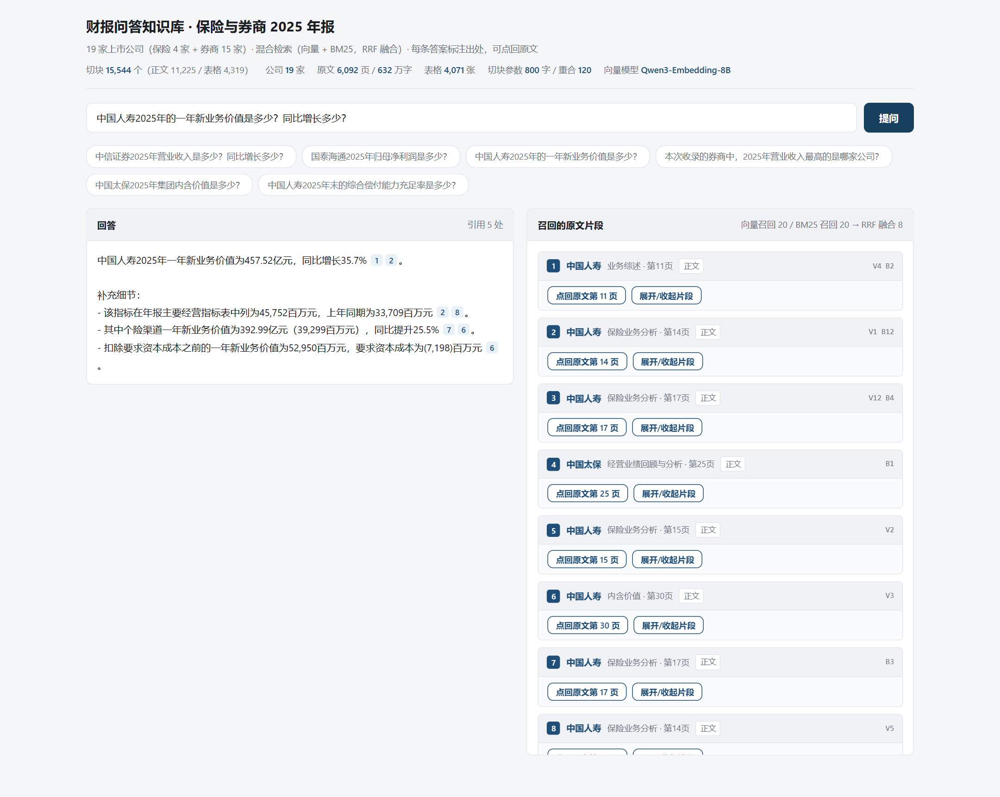
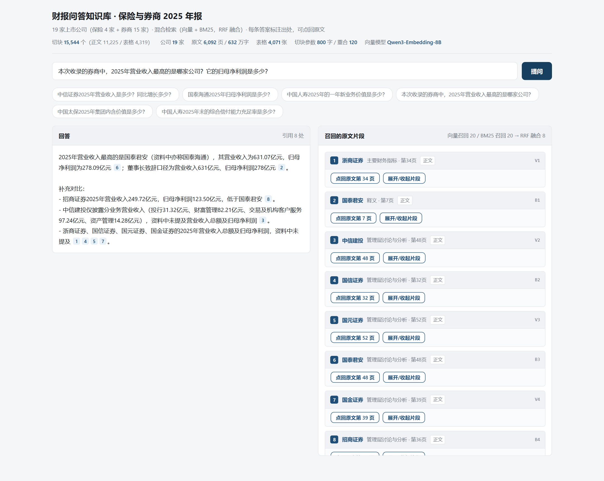
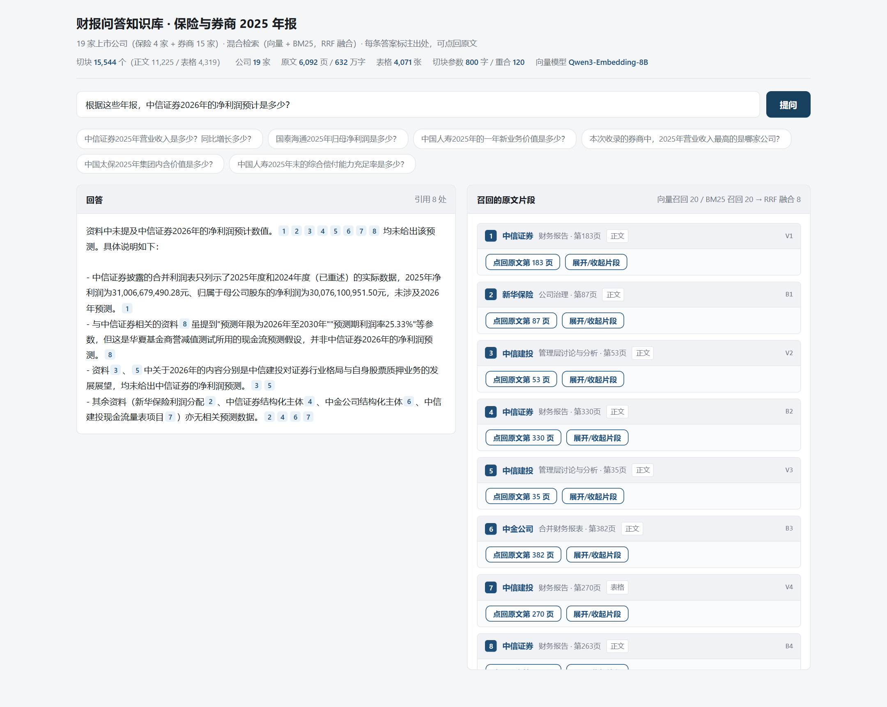
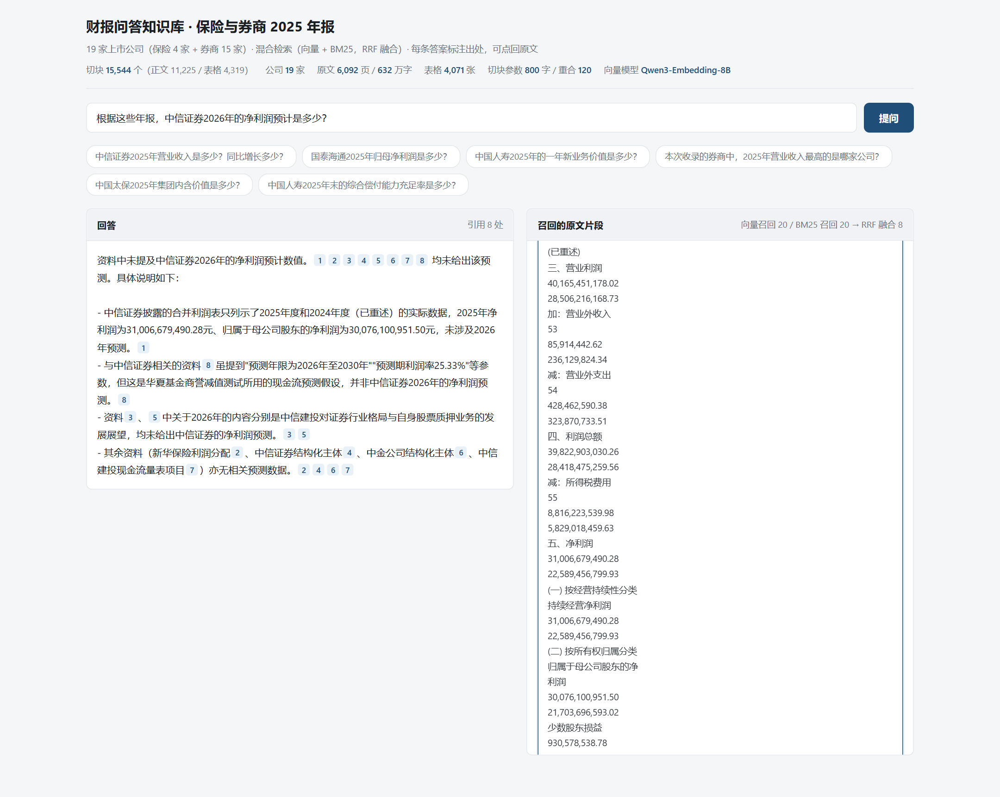

# 财报问答知识库（保险 + 券商 · 2025 年报）

从巨潮资讯网批量下载 A 股上市保险公司与券商的 2025 年年度报告 PDF，
解析正文与表格、切块、建**向量 + BM25 双索引**，用 RRF 融合做混合检索，
再接大模型生成**带出处标注**的回答。

**实测结果**：19 家公司 / 6092 页 / 632 万字 / 4071 张表格 / 15544 个切块。
10 道评测题**答对 8 道，检索层命中率 90%**。详见 [`docs/结论.md`](docs/结论.md)。

## 语料范围

| 类别 | 公司 |
|---|---|
| 保险（4 家） | 中国太保、中国人寿、新华保险、中国人保 |
| 券商（15 家） | 中信证券、国泰君安（年报称国泰海通）、华泰证券、招商证券、中国银河、广发证券、中信建投、国信证券、东吴证券、申万宏源、浙商证券、长江证券、国金证券、国元证券、中金公司 |

统一使用 **2025 年年度报告**（不是年报摘要、不是英文版、不是更正后版本）。

> **为什么是 19 家而不是 20 家**：候选清单里有中国平安与东方证券，
> 但巨潮资讯上这两家查不到 2025 年年报**正文**（平安只返回「业绩公告」类文件，
> 东方证券只返回「年度报告摘要」），因此未纳入。
> 作业要求「10 家以上」，19 家已满足。
> 另外中国人保的 PDF 使用自定义嵌入字体，**中文字符可提取但数字提取不到**，
> 其营收/偿付能力/员工人数在本库中实际缺失——这是已知短板，见 `docs/结论.md`。

## 处理流程

```
01_download.py   巨潮资讯批量下载 PDF（断点续传、限速、PDF 头尾校验）
02_extract.py    PyMuPDF 提取正文 + 按词坐标还原表格 + 三路合并建立章节映射
03_build_index.py 800字/120字重叠切块 → 在线 Embedding 向量 + BM25 倒排
04_serve.py      Flask 问答页（答案带 [n] 角标，可点回原文页）
05_evaluate.py   10 道题评测，逐题记录召回与对错
06_report.py     渲染 docs/评测记录.md
check_api.py     向量 API 自检：连通性 / 维度 / 语义质量 / 吞吐 / 断点续传
common.py        路径、配置（读 .env）、公司清单
embed_api.py     硅基流动 Embedding 客户端（重试退避 + 分批落盘断点续传）
bm25_index.py    jieba 分词 + BM25 类（必须与 pickle 同模块，故独立成文件）
retriever.py     混合检索：向量 + BM25 → RRF 融合
llm.py           DeepSeek 调用 + 引用编号出口校验
```

### 章节是怎么解析出来的（最花时间的一块）

A 股年报的目录版式实测差异极大，脚本用三路合并才把 19 家全覆盖：

1. **正文标题扫描**：找「第一节 xxx」「第一节」+下一行节名，页码绝对可靠，但只覆盖约一半公司；
2. **目录坐标解析**：按词坐标分栏（实测中金 2 栏、浙商/太保 3 栏、页码列与名称列分离），
   栏内按 y 邻近配对，能拿到齐全的章节名，但页码是印刷页码；
3. **页码偏移校准**：用前两路共有的章节算出偏移众数（实测国信偏 5 页、银河偏 3 页），
   把目录里独有的章节按校正后的页码并入。

另有若干踩坑已写进代码注释：目录跨两页（太保）、超大号装饰数字被误判成页码、
光秃秃的节号「第一节」必须排除、「集团治理与债券相关情况」这类粘连要切断。

## 关键设计（对照课件「半年报库的切块」「混合检索」）

| 项 | 取值 | 依据 |
|---|---|---|
| 切块 | 800 字 / 重叠 120 字 / 尽量句末收尾 | 课件指定 |
| 表格切块 | 按行切，每块 ≤14 行，保留「科目 \| 本期 \| 上期」 | 课件指定 |
| 向量化文本 | 前面拼上「公司名（代码） 章节名」 | 课件指定，否则检索时分不清是谁的数 |
| 向量模型 | Qwen3-Embedding-8B @ 硅基流动在线 API（1024 维） | 用户指定；本地放不下 8B |
| 检索指令 | 查询侧拼 `Instruct: ...\nQuery: `，文档侧不拼 | Qwen3-Embedding 官方要求，漏了会掉点 |
| 回答模型 | DeepSeek `deepseek-flash` | 用户指定 |
| 检索 | 向量召回 20 + BM25 召回 20 → RRF(k=60) → 取前 8 | 用户指定 |
| 引用约束 | 提示词强制每句带 `[n]`，生成后校验编号有效性 | 课件「带引用的生成」 |

## 快速开始（新设备从零跑）

仓库里**只有代码**，没有 PDF / 索引 / 模型，需要按顺序跑一遍。

```bash
# 0. 依赖（Python 3.11+）。不需要 torch / CUDA，10MB 出头就能装完
pip install -r requirements.txt

# 1. 配置（key 只放 .env，已被 .gitignore 忽略）
cp .env.example .env
# 编辑 .env 填两个 key：
#   DEEPSEEK_API_KEY     → https://platform.deepseek.com
#   SILICONFLOW_API_KEY  → https://cloud.siliconflow.cn/account/ak

# 2. 自检向量 API（可选但建议，通不过就别往下跑）
python scripts/03_build_index.py --chunks-only   # 先切块
python scripts/check_api.py                       # 连通性 / 维度 / 语义 / 吞吐

# 3. 跑流程
python scripts/01_download.py               # 下载 PDF（183MB，约 40 秒，需联网到巨潮）
python scripts/02_extract.py                # 提取正文与表格（约 4 分钟）
python scripts/03_build_index.py --workers 6 # 切块 + 在线向量化（约 13 分钟）+ BM25
python scripts/05_evaluate.py               # 跑 10 道题评测
python scripts/06_report.py                 # 生成 docs/评测记录.md
python scripts/04_serve.py                  # 起服务，浏览器打开 http://127.0.0.1:8000

# 4.（可选）重跑页面截图，需要 Node
npm install
node scripts/shot.js --port 8000           # 输出到 shots/
```

`data/` 会在运行时自动创建，不需要手动建目录。

**中断了可以直接重跑**：向量化是分批落盘的（`data/index/_parts/`），
重跑会跳过已完成的批次接着跑，不用从头来。
`--workers` 是并发请求数，串行时 972 批要 2 小时，并发 6 约 13 分钟。

## 向量化：为什么走在线 API

向量化原本是本项目唯一的瓶颈，现在**整个问题消失了**——因为改用
硅基流动的 `Qwen/Qwen3-Embedding-8B` 在线 API（1024 维）：

| | 本地跑 0.6B | 在线跑 8B |
|---|---|---|
| GTX 1660 Ti 6GB | 约 20-40 分钟 | — |
| 纯 CPU 16 线程 | 约 1.6-4 小时 | — |
| **在线 API** | — | **约 15-30 分钟** |
| 依赖 | torch + CUDA 轮子（约 2GB） | 只要 requests |
| 检索质量 | MTEB 64.33 | **MTEB 70.58（多语言第一）** |
| 成本 | 0 | 约 ¥4（8B ¥0.28/M tokens，16392 块）|

目标机器（1660 Ti 6GB / 16GB 内存）**装不下 8B**，退到 0.6B 又慢；
在线 API 同时解决了速度、质量、依赖三个问题。核显/IPEX 那条路也不再考虑。

### 调参（都写��� `.env`，一般不用动）

| 变量 | 默认 | 说明 |
|---|---|---|
| `EMBED_DIM` | 1024 | 8B 支持 64~4096。改这个**必须重建索引**，retriever 会检测维度不符直接报错 |
| `EMBED_API_BATCH` | 16 | 每批文本条数。一次塞太多容易 400 或撞 TPM 限流 |
| `EMBED_API_INTERVAL` | 0.15 | 两次请求最小间隔（秒），自我限速 |
| `EMBED_API_MAX_RETRIES` | 6 | 429/5xx 的重试次数，走指数退避 |
| `EMBED_API_TRUNCATE` | 空 | 模型支持 32K，财报块 800 字用不到截断 |

命令行也能临时覆盖：`python scripts/03_build_index.py --batch 32 --fresh`。

### 三个真实踩到的坑（已在代码里处理）

1. **429 限流 + 503 模型过载**：必须**指数退避 + 随机抖动**重试。
   没有抖动会形成惊群效应——多个请求同时被限流，又同时重试，永远撞在同一波限流上。
2. **返回条数与请求数不一致**：服务端可能只返回部分向量。必须按响应里的
   `index` 字段**归位**，直接按顺序 append 会让向量与切块整体错位，
   检索结果全是噪声且不报错——这种 bug 极难发现。
3. **401/400 不要重试**：401 是 key 无效、400 是参数错误（如文本超长），
   重试一万次也没用。脚本对这三类错误立刻抛出并给出排查提示，
   只对 429/5xx 重试。

### 断点续传

16392 块要发 1000+ 次请求，中间必然遇到限流或断网。
`03_build_index.py` 每批结果立刻存到 `data/index/_parts/`，
中断后重跑**自动从断处继续**，不会从头再来。合并成 `vectors.npy` 后分片自动清理。

切换 `EMBED_API_BATCH` 会让分片与批次错位，脚本检测到 batch 变了会自动重置分片
（拿旧分片配新块会彻底错位）。想强制重来用 `--fresh`。

### 模型一致性

`retriever.py` 从 `data/index/meta.json` 读取建索引时的模型与维度。
换了模型或维度却用旧索引，**向量空间不同、余弦相似度完全无意义**——
脚本会直接抛错而不是给你一堆看似正常的错误结果。

## 实测数据

在 Intel Core Ultra X7 358H / 16 线程 / 无独显的机器上，从零跑完整流程：

| 环节 | 实测 |
|---|---|
| 下载 19 份 PDF | 183 MB，约 40 秒（巨潮，有限速 + 3 次重试 + PDF 头尾校验） |
| 提取正文 + 表格 | 6092 页 / 632 万字 / 4071 表，约 4 分钟 |
| 切块（800 字 / 重叠 120） | 15544 块，约 25 秒 |
| **在线向量化（8B / 1024 维）** | **13 分钟，¥2.23，零限流**（并发 6 路） |
| BM25 建索引 | 20 秒，词表 78078 |
| 10 题评测（含 LLM 生成） | 约 2 分钟 |

**章节元数据覆盖率 99.63%**（仅 57 块无章节名，都是封面与目录页本身）。

向量化并发很关键：串行时每批一次往返 ≈0.7 秒，972 批要 2 小时；并发 6 路后压到 13 分钟。

## 评测结果

**10 题答对 8 题，检索层命中率 90%**：

| 题型 | 题数 | 答对 | 正确率 |
|---|---|---|---|
| 事实型（问单个数字） | 4 | 3 | 75% |
| 业务指标（寿险特有） | 3 | 3 | **100%** |
| 跨公司全景 | 2 | 1 | 50% |
| 陷阱型（库里没有，看会不会编） | 1 | 1 | **100%** |

两道错题都是**检索层先失败**，不是模型乱答：

1. **国泰君安 / 国泰海通**：库里登记名与年报正文自称不一致，同一主体两种称呼对不上，
   召回的 7 块内容其实都对，但判分与模型表述都失准。
2. **「哪家券商营收最高」**：正确答案（中信证券 748.54亿元）所在的块没进 top-8，
   模型拿召回里次高的国泰海通作答，**输出了一段完全自洽、带引用角标却是错的话**——
   这是最危险的一类错误。

详见 [`docs/结论.md`](docs/结论.md)（含逐题召回明细与改进方向）。

## 页面截图

| | |
|---|---|
|  |  |
| 问答主界面，每条答案带 `[n]` 角标可点回原文 | 事实型：748.54亿元 / +28.79% 精确命中 |
|  |  |
| 业务指标：新业务价值 457.52 亿元 | 跨公司全景：本文档记录了它的失败案例 |
|  |  |
| 陷阱型：模型明确说「未提及」而**没有编造** | 点 `[n]` 角标定位到右侧对应原文块 |

## 安全约定

- `.env` 与 `.env.*` 已被 `.gitignore` 忽略（但放行 `.env.example`），**API key 不会进仓库**。
- 财报 PDF **不入库**，`.gitignore` 排除了 `data/pdf/`、`data/text/`、`data/index/`、`data/logs/`；
  仓库里只保留可复现的下载与解析脚本。
- 页面与截图里不出现任何密钥（已用 `grep -rI "sk-[a-zA-Z0-9]\{20,\}"` 全仓扫描确认）。
- `node_modules/` 不入库（截图脚本用的 `puppeteer-core`，见 `package.json`）。

## 目录结构

```
scripts/            六个编号脚本 + common/embed_api/bm25_index/retriever/llm
web/index.html      问答页（单文件，含全部样式与前端逻辑）
docs/结论.md         一页结论：哪类题答得好、哪类翻车、为什么
docs/评测记录.md     逐题明细（含召回块、原文片段、错因分析）
shots/              页面截图（5 类题型 + 首页）
data/               运行时数据（PDF / 文本 / 索引 / 评测结果），全部不入库
```

## 已知局限（实测发现的，不是猜的）

1. **中国人保的数字整体缺失**（最严重）：其 PDF 用自定义嵌入字体渲染数字，
   PyMuPDF 能抽出中文字符但**抽不出数字**——经营亮点页变成「集团总资产亿元，较上年末增长」。
   因此人保的营收、偿付能力、员工人数**在库里根本不存在**，问「5 家保险公司对比」时
   实际只能覆盖 4 家。表格脚本会退化成「单列科目表」并标记 `degraded: true`。

2. **公司更名会静默毁掉一整类问题**：国泰君安（601211）在 2025 年完成合并重组，
   年报正文自称「国泰海通」。库里登记名是「国泰君安」，于是同一主体两种称呼在向量空间对不上——
   实测第 2 题召回的 8 块里**有 7 块内容完全正确**，但判分判失败、模型也只能给出整数口径
   （「278 亿元」而非 278.09 亿元）。**不报任何错，是最隐蔽的一类问题。**

3. **跨公司「谁最高」类问题超出 top-k 检索的能力**：实测第 8 题里，
   正确答案所在的块没进 top-8，模型拿次高的国泰海通作答，
   **输出了一段完全自洽、带引用角标、格式规范却是错的话**。
   RRF 无法补救——BM25在「最高 / 排名」这类词上每家都命中、没有区分度。
   要做对必须改成两段式：按公司分组各取 top-1，再在代码里排序。

4. **章节名粒度不均**：19 家年报的目录版式差异极大（单栏/双栏/三栏、页码在前在后、
   目录跨两页、节名拆行）。脚本用了「正文标题扫描 + 目录坐标分栏配对 + 页码偏移校准」
   三路合并，最终 19 家全部有章节名，覆盖率 99.63%，
   但粒度仍不统一（浙商证券 8 章、中金公司 18 章）。

5. **只覆盖 2025 实际数**：库里没有 2026 预测、没有历史多年对比，
   问这类问题模型必须说「未提及」。提示词已约束，页面上也做了无效引用编号告警。